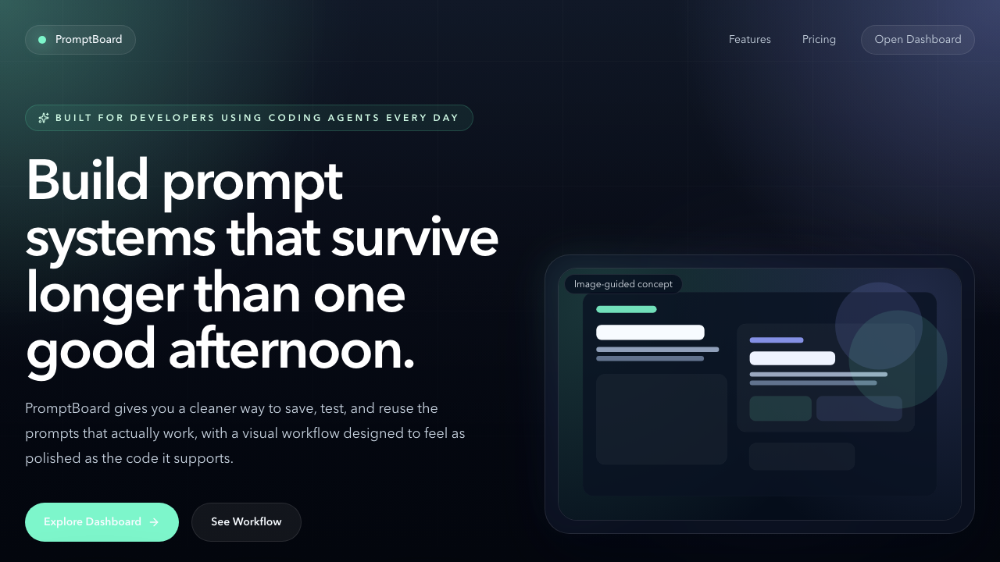
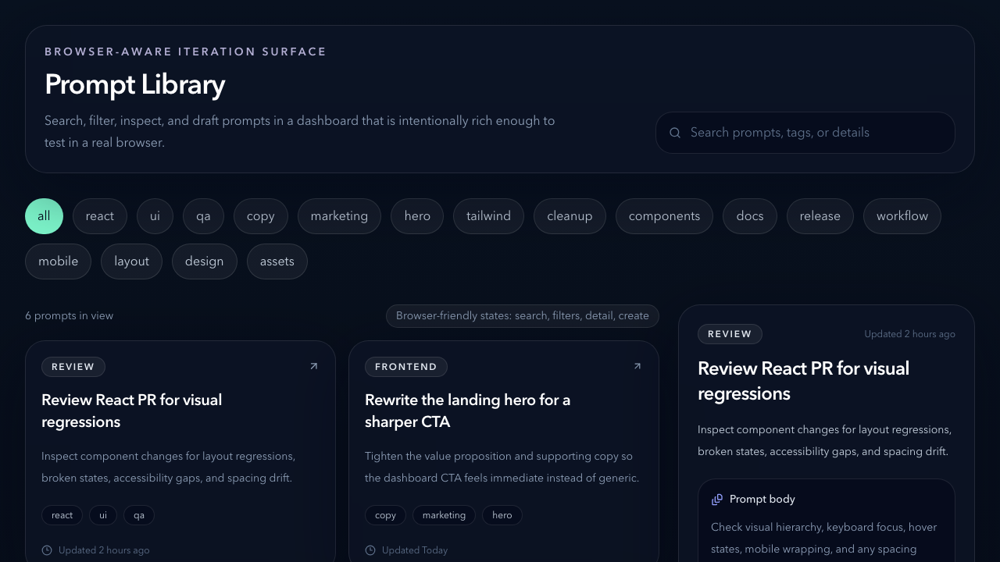

# PromptBoard

PromptBoard is a fictional developer-tool product built to demonstrate two GPT-5.4 / Codex-style frontend workflows in one publishable repo:

1. Image-guided frontend design
2. Browser-aware UI iteration and verification

The app combines a polished marketing page with an interactive prompt dashboard so the repo can show both visual direction and real browser-level interaction.

## Live Demo
[promptboard-omega.vercel.app](https://promptboard-omega.vercel.app)

## What This Repo Demonstrates
- A premium dark-mode SaaS landing page for a developer product
- A dashboard for saving, filtering, inspecting, and drafting prompts
- Generated design assets committed under `public/generated`
- UI iteration that is designed to be verified in the browser
- Playwright coverage for key landing and dashboard flows
- Repo-level instructions for future agent work in `AGENTS.md`

## The Two Workflows
### 1. Image-guided frontend design
PromptBoard uses committed visual assets in [`public/generated`](/Users/sanjay/personalProjects/promptBoard/public/generated) to shape the landing page mood, hero composition, and dashboard atmosphere. The prompts and design notes live in [`docs/prompts.md`](/Users/sanjay/personalProjects/promptBoard/docs/prompts.md).

### 2. Browser-aware iteration and verification
The dashboard intentionally includes searchable cards, tag filters, a detail surface, a create form, and responsive behavior so the UI can be inspected and verified as a real interface. Playwright tests live in [`tests/promptboard.spec.ts`](/Users/sanjay/personalProjects/promptBoard/tests/promptboard.spec.ts).

## Stack
- Next.js
- TypeScript
- Tailwind CSS
- Lucide React
- Playwright

## Local Setup
```bash
npm install
npm run dev
```

Visit [http://localhost:3000](http://localhost:3000) for the landing page and [http://localhost:3000/dashboard](http://localhost:3000/dashboard) for the interactive app surface.

## Test Commands
```bash
npm run lint
npm run test:e2e
```

## Deploying On Vercel
PromptBoard is deployment-ready for the free Vercel Hobby plan.

### Fastest path
1. Sign in to [Vercel](https://vercel.com/) with GitHub.
2. Import `sanjaynela/promptBoard`.
3. Keep the default Next.js build settings.
4. Deploy from the `main` branch.

### CLI path
```bash
vercel login
vercel
vercel --prod
```

The app does not require environment variables for the current demo version.

Note: the current production deployment is live at [promptboard-omega.vercel.app](https://promptboard-omega.vercel.app).

### Post-deploy checks
- Confirm `/` loads correctly.
- Confirm `/dashboard` loads correctly.
- Confirm the assets in `public/generated` render in production.
- Confirm search, filters, detail view, and in-session prompt creation still work.
- Confirm the mobile layout remains usable.

## Generated Asset Workflow
The image prompts, their intended role, and the browser-inspection prompts used for refinement are documented in [`docs/prompts.md`](/Users/sanjay/personalProjects/promptBoard/docs/prompts.md).

## Screenshots



## Why This Repo Exists
This project turns the article’s PromptBoard idea into a concrete frontend experiment. It is meant to show how coding agents can help with:
- design direction before the UI feels right
- browser-aware iteration after the UI exists
- repeatable verification before code is pushed

## Notes
- This repo uses only mock data.
- No credentials or machine-specific auth material should ever be committed.
- The git author identity for personal projects can be configured locally with [`setup-personal-git.sh`](/Users/sanjay/personalProjects/setup-personal-git.sh).
- The recommended free deployment target for this repo is Vercel Hobby.
